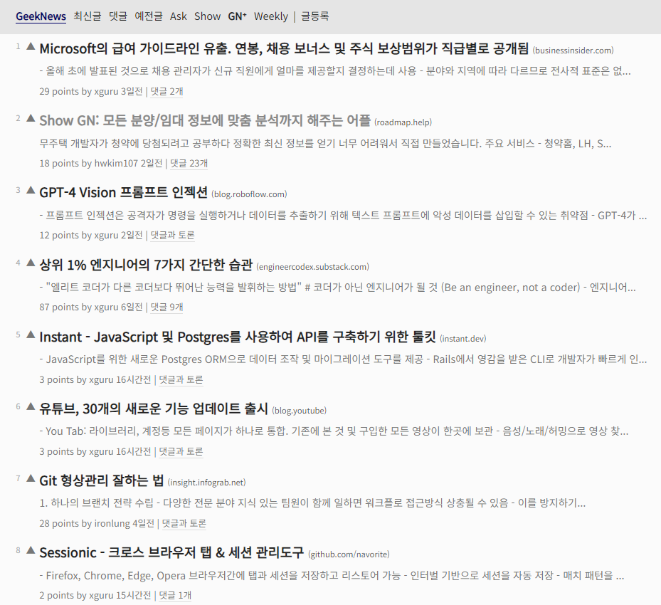
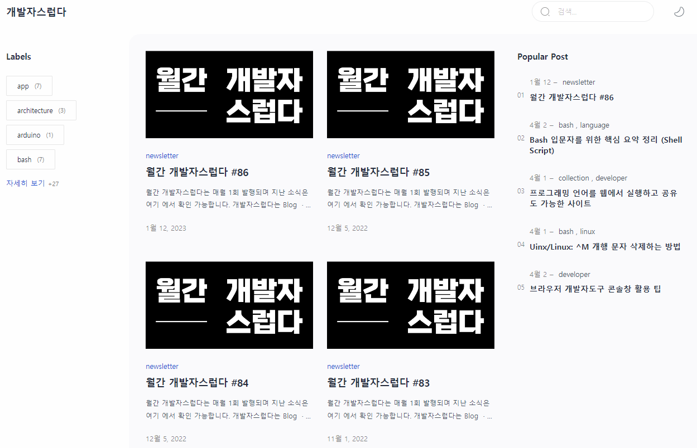
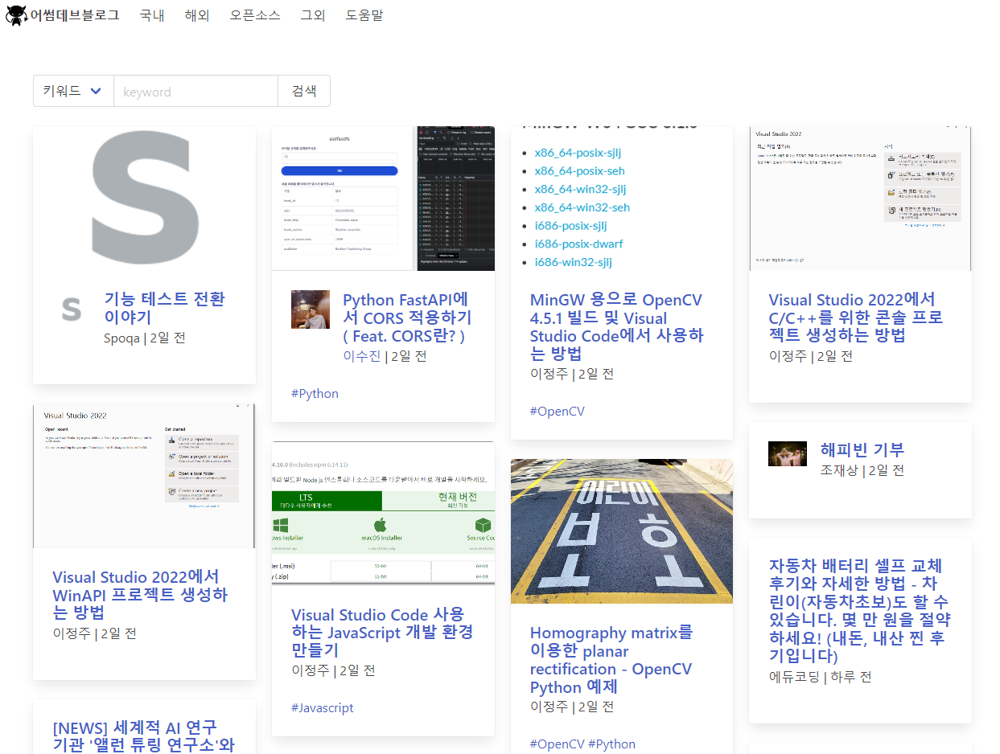
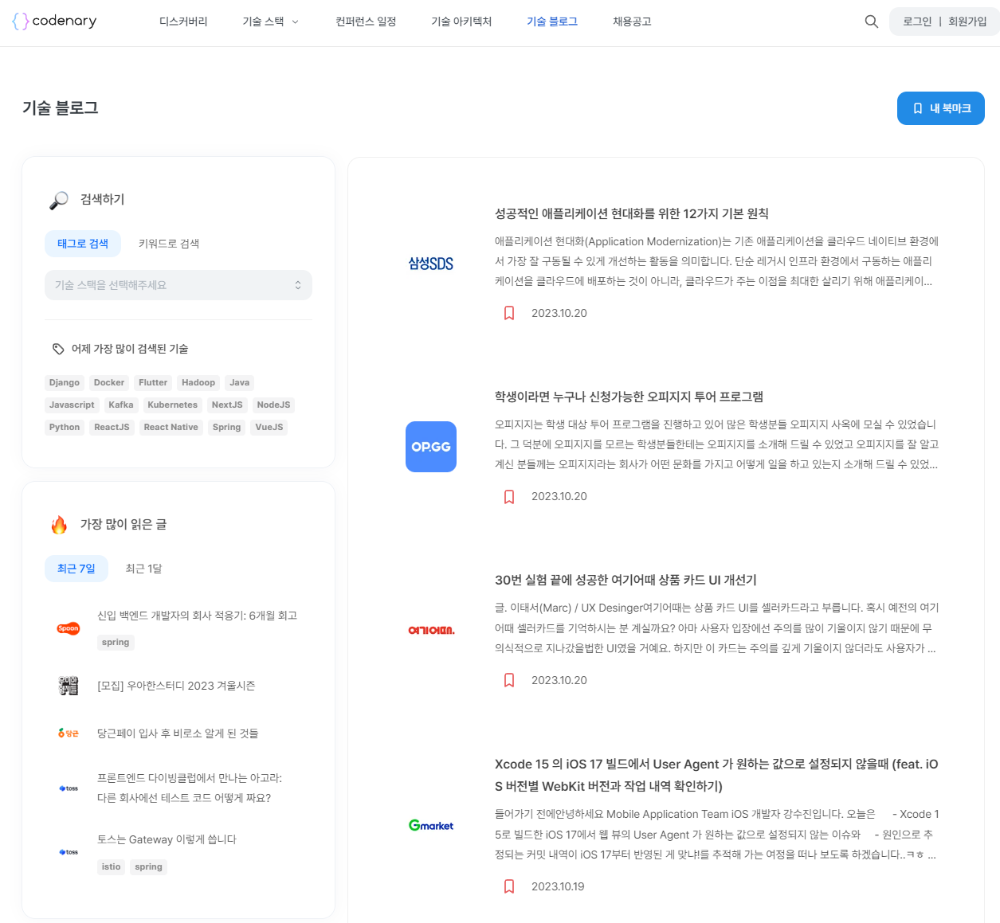
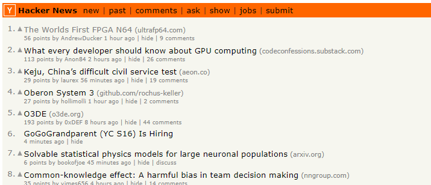
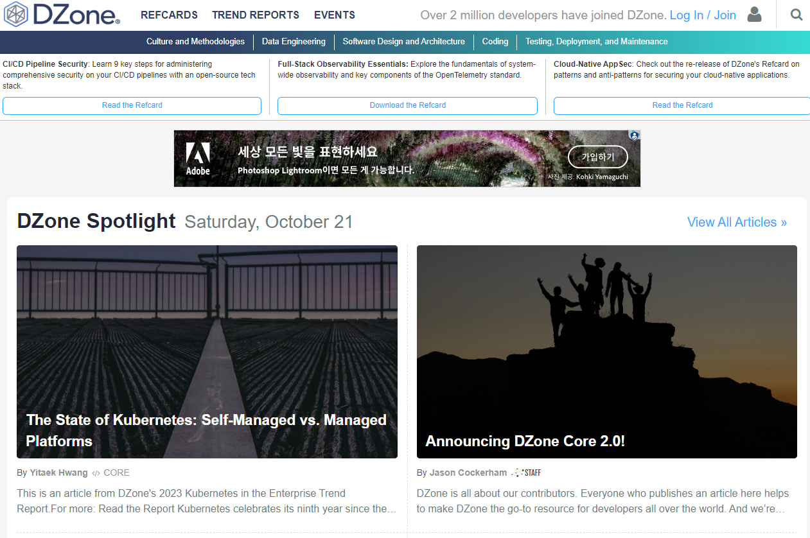

# 개요
- 개발 아티클들을 찾아볼 수 있는 사이트 소개

# 소개 및 특징
## [GeekNews](https://news.hada.io)

- 외부 아티클들을 요약하고, 번역해서 공유해 주는 글들이 많음
- outlink로 연결되는 경우도 있음
- 댓글과 토론 기능이 존재, 아티클을 요약하고 의견을 남길 수있는 공간이 있음

## [출퇴근 개발 읽기](https://github.com/Integerous/goQuality-dev-contents)
- 오픈카톡방을 기반으로 운영되고 있음
- 출퇴근 길에 간단하게 읽을 수 있는 아티클들을 공유
- 깃헙에 아카이빙되고 있기 때문에, 아카이브를 통해 확인 가능
  - 6개 카테고리로 나뉘어서 제공

## [월간 개발자스럽다](https://blog.gaerae.com)

- 뉴스레터를 기반으로 운영
- 월 1회 발행
- 사이트를 통해 아카이빙
- 2023년 1월까지 운영된 것으로 보이며, 현재는 아카이빙된 글만 존재하는 것으로 보임

## [어썸데브블로그](https://awesome-devblog.netlify.app)

- 개발 블로그들을 큐레이션하여 볼 수 있도록 만들어 둔 사이트
- 국내 / 해외 / 오픈소스 등으로 카테고리를 나누어 운영
- 뉴스레터로 구독하여 받아볼 수 있음
- 최근 트렌드가 많이 반영되는 사이트
- 개인 블로그들을 보기 좋은 사이트

## [코드너리](https://www.codenary.co.kr)

- 기업별 기술 블로그들을 모아보기 좋음
- 컨퍼런스 일정도 확인 가능
- 아키텍처 카테고리가 별도로 있어서, 기업별 아키텍처를 확인 가능
- 기술 스택 기업별 확인 가능

## [Hacker News](https://news.ycombinator.com)

- Geeknews처럼 간단한 포맷으로 만들어져 있음
- 코멘트를 달 수 있는 기능 존재

## [Dzone](https://dzone.com)

- Agile, AI, Big Data, Cloud, Database 등 여러 분야를 다루고 있음
- 인프라 / 백엔드 위주 운영

# 참고자료
- https://www.youtube.com/watch?v=YFdHEbuSWMU