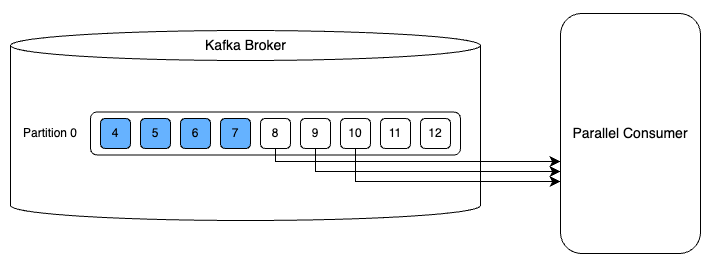

# 개요
- Parallel Consumer를 이용하여 적은 파티션으로 높은 동시 처리량을 만족하는 방법
- Parellel Consumer 개요, 동작, 내부 구조 설명

# 내용
## Parallel Consumer
- 기존 컨슈머의 병렬 처리 단위는 파티션으로, 동시 처리량을 위해서는 파티션을 늘려야 함
- 그러나 파티션을 늘리면 단점이 존재
  - 브로커 파일의 시스템 리소스 사용량 증가(데이터 파일뿐 아니라 메타정보까지)
  - 장애에 취약함(단일 프로커에 파티션 리더 배치 증가로, 장애 범위가 넓음)
  - 복제 비용 증가(파티션 단위 레플리카만큼 복제가 이루어지기 때문에 레이턴시 증가)   
 

- Parallel Consumer
  - Confluent에서 만든 오픈소스
  - 단일 파티션에 여러 컨슈머 스레드를 이용하여 파티션을 늘리지 않고 동시 처리량을 증가

- 병렬 처리 단위를 파티션이 아닌 개별 kafka 메시지 등 단위로 지정 가능
- 
  - 그림처럼 단일 파티션에서 병렬 처리 가능

## 그래서 어떻게 병렬 처리를 할까?
- 기존 카프카는 하나의 메시지를 처리하여 auto 커밋 방식 사용
- 여러개의 메시지를 처리한 후 오프셋을 수동 커밋할 수 있음
- 컨슈머 단에서 메시지 처리도 병렬로 할 수 있음
- 위의 두 방식을 혼합 + 오프셋 갱신을 비동기로 수행(처리 결과를 임시 저장, 주기적으로 오프셋 커밋) 
-> 병목 없이 연이어 처리 가능 
- 오프셋의 처리 보장을 위해 처리 완료한 가장 마지막 오프셋을 커밋

## 그러면 순서 보장이 필요한 경우 어떻게 할까?
- 기존처럼 파티션 단위 순서는 보장하기 때문에, 카프카 파티션 방식 사용 가능
  - 파티션 단위로 스레드 분배하여 병렬 수행
- Parallel Consumer의 키 단위 순서 보장 방식 존재, 동일 파티션 내에도 키가 다르면 메시지 병렬 처리 가능
  - 키 단위로 샤드를 만들어 스레드 분배하여 병렬 수행
- UnOrdered도 존재
  - 파티션 개수만큼 샤드가 생기지만, 한 파티션 샤드 내 메시지가 여러 스레드에서 동시 소비 가능

## 내부 구조
- Broker Poller Thread
  - 실제 카프카 브로커와 통신하는 스레드
  - 메시지를 가져와서 Mailbox에 저장
- Controller Thread
  - 메인 로직
  - Mailbox에서 메시지를 가져와서 Worker Thread에 전달, 메시지 커밋 담당
- Work State Thread Pool
  - 전달받은 메시지 처리

## 메시지 중복 처리 방지
- 4,5,6,7 오프셋 처리 중 4,6,7번 오프셋은 처리하고 5번은 처리하지 못했다고 가정
- 이경우 4번 오프셋까지 완료되었다고 커밋
- 이때 장애로 브로커 서버 재시작 시, 마지막 처리 오프셋을 4번으로 인식하는데, 이때 6,7번 오프셋은 이미 처리되었는데 어떻게 처리할까?
- 이를 위해 Parallel Consumer에는 오프셋 메타데이터에 완료되지 않은 오프셋을 저장해 둠
- 해당 정보를 확인하여 메시지 처리 여부를 결정

# 참고문헌
- https://d2.naver.com/helloworld/7181840?ref=codenary